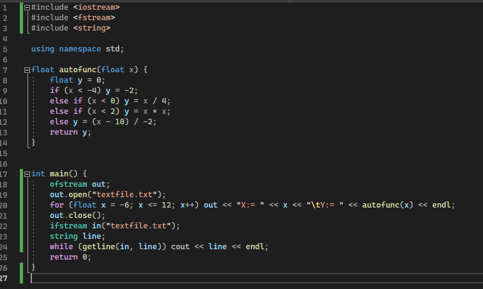

# Лабораторная работа 2
## Запись и чтение данных из текстового файла
Необходимо записать полученные данные из первой лабораторной работы в текстовый документ, после необходимо вывести их из файла в консоль

